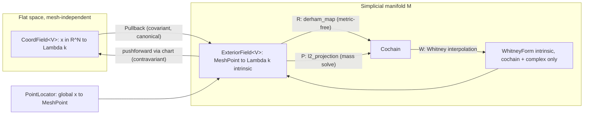

# Exterior Fields: Sections over the Simplicial Manifold

## The mathematical picture

The key realization: the codebase has **two different kinds of "field"** conflated into one trait today, and the refactor separates them and connects them functorially.

1. **Coordinate fields** on flat space: \(x \mapsto \omega(x)\) for \(x \in \Omega \subset \mathbb{R}^N\). Mesh-independent analytic data (exact solutions, sources). This is what `DiffFormClosure` already is.
2. **Exterior fields**: sections of \(\Lambda^k T M\) or \(\Lambda^k T^* M\) over the *simplicial manifold* \(M\). The mesh **is** the manifold — a piecewise-flat Riemannian manifold whose atlas is the cells (charts = reference simplex maps, transition maps = affine face gluings). A point of \(M\) is intrinsically `(cell, barycentric coords)` — exactly as you suspected, and exactly what `CellLocation` in [crates/manifold/src/geometry/coord/locate.rs](crates/manifold/src/geometry/coord/locate.rs) already computes. This works with **no embedding at all** (Regge `MeshLengths` / `CellGramians` geometry), which is why it must be the backbone: on an intrinsic manifold there simply is no global coordinate.

Values are expressed in the **reference frame of the containing cell** (intrinsic dimension \(n\)), measured by the cell metric from the existing `Geometry` trait. The two worlds connect through the variance-directed functor:

- Covariant: coordinate forms **pull back** along the embedding chart onto the mesh (canonical, no metric needed).
- Contravariant: mesh multivector fields **push forward** along the chart Jacobian into ambient space (canonical direction is reversed).

That the natural transformation direction flips with variance is precisely the `Variance` machinery already in `ExteriorElement` — the field layer finally inherits it.

Answer to "mesh-dependent or independent?": coordinate fields are mesh-independent; exterior fields live on the manifold, hence on the mesh. Flat space composes without hassle: wrap a coordinate field in the pullback adapter (one call). Curved manifolds need no continuous parametrization: the simplicial atlas is the representation. (A future `CellChart` trait with pointwise Jacobians would slot in for curved/isoparametric elements without changing this design — the affine `SimplexCoords` chart is just its constant-Jacobian case. Not built now.)



## Core abstractions

### 1. `exterior::field` — coordinate fields, generic over variance

Replace the covariant-only `ExteriorField` in [crates/exterior/src/field.rs](crates/exterior/src/field.rs):

```rust
/// A field of exterior elements on a flat coordinate domain in R^n.
pub trait CoordField<V: Variance> {
  fn dim(&self) -> Dim;
  fn grade(&self) -> ExteriorGrade;
  fn at(&self, x: VectorView) -> ExteriorElement<V>;
}

pub struct FieldClosure<V: Variance> { /* boxed closure, dim, grade */ }
pub type DiffFormClosure = FieldClosure<Covariant>;
pub type MultiVectorFieldClosure = FieldClosure<Contravariant>;
```

Keep the `scalar` / `one_form` / `constant_scalar` / `coordinate_component` / `radial_scalar` constructors on `FieldClosure` (variance-appropriate). Delete the dead `FormPullback`.

### 2. `manifold` — the point of the manifold

Promote `CellLocation` to a first-class `MeshPoint { cell: SimplexIdx, bary: Coord }` (new module `manifold::geometry::coord::point` or alongside `locate`), with helpers (`local()`, `from_local`, cell barycenter). `PointLocator::locate` returns it. This is the local coordinate system `(CellId, BarycentricCoords)` you described; barycentric is the right chart because it is symmetric and affine-invariant.

### 3. `ddf::field` — the central trait: sections over the manifold

New module [crates/ddf/src/field.rs](crates/ddf/src/field.rs) (`ddf` is where `Complex` + exterior meet):

```rust
/// A section of the exterior bundle over the simplicial manifold:
/// V = Covariant is a differential form, V = Contravariant a multivector field.
/// Values in the reference frame of the containing cell chart.
pub trait ExteriorField<V: Variance> {
  fn dim_intrinsic(&self) -> Dim;
  fn grade(&self) -> ExteriorGrade;
  fn at(&self, p: &MeshPoint) -> ExteriorElement<V>;
}
```

Implementors and adapters:
- `Pullback<'a, F: CoordField<Covariant>>` — holds `(&F, &Complex, &MeshCoords)`; `at` maps bary → global through the cell chart (`SimplexCoords`), evaluates, pulls back through the chart's linear map. Implemented **only for Covariant** — the type system enforces the functorial direction. Ergonomic entry: an extension method like `f.pullback_on(&topology, &coords)`.
- Pointwise combinators (lazy wrapper structs, values already support the ops): `Wedge`, and metric ones `Sharp`/`Flat`/`HodgeStar` taking an `&impl Geometry` for the cell metric. This is where both variances live on equal footing: `omega.sharp(&geometry)` is a first-class multivector field.
- Optionally a `FieldClosure`-analogue on `MeshPoint` for tests.

### 4. Whitney forms become intrinsic (big simplification)

Rewrite [crates/ddf/src/whitney/form.rs](crates/ddf/src/whitney/form.rs) and [lsf.rs](crates/ddf/src/whitney/lsf.rs):
- `WhitneyForm` holds only `(Cochain, &Complex)` — **no `MeshCoords`, no locator**. `at((cell, bary))` evaluates LSFs with *reference* barycentric differentials (`WhitneyLsf::standard`): pure combinatorics, the Koszul contraction with λ pulled back along reference `difbarys`. Whitney forms thereby work on purely metric (Regge) manifolds — currently impossible.
- `WhitneyLsf` takes barycentric input directly (drop the `global2bary` inverse-affine dance and the coordinate-simplex constructor where unused).
- Global-point evaluation becomes a separate concern: a sampling adapter combining `PointLocator` (global → `MeshPoint`) with an ambient-frame extension of the value via the chart pseudo-inverse (what `difbarys` of the coordinate simplex does today) — used only for visualization/IO, e.g. in `hodge_laplace_evp`.

### 5. Discretization: de Rham map (canonical) + L² projection (complementary)

- `derham_map` in [crates/ddf/src/derham.rs](crates/ddf/src/derham.rs) now takes `&impl ExteriorField<Covariant>`. Key beauty: \(\int_\sigma \omega\) is **metric-free**, so the intrinsic implementation pairs the field value with the face's tangent blade *in the reference frame of a supporting cell* — quadrature points on the face expressed in cell barycentric coordinates, purely affine/combinatorial. Existing tests (`R∘W = id`, `R∘d = d∘R`) keep guarding it. A thin convenience for coordinate fields wraps the pullback adapter.
- New `l2_projection(field, &WhitneyComplex, qr) -> Cochain` in formoniq (needs assembly + solver): assemble Hodge mass and source load, Cholesky solve. Document the trichotomy: \(W\) (interpolation), \(R\) (canonical cochain projection, commutes with \(d\)), \(P_h\) (best approximation, defined on all of \(L^2\Lambda^k\), no commutation).

## Migration (formoniq layer)

- `ElVecProvider::eval` in [crates/formoniq/src/operators.rs](crates/formoniq/src/operators.rs) gets the cell handle (`SimplexRef`) instead of `&Simplex` (available at the call site in [assemble.rs](crates/formoniq/src/assemble.rs)); `SourceElVec` becomes generic over `ExteriorField<Covariant>` and fully intrinsic — the manual `at_point(global).pullback(...)` dance disappears, and source assembly works on Regge geometry.
- `fe_l2_error` in [crates/formoniq/src/fe.rs](crates/formoniq/src/fe.rs): integrate `exact.at(p) - whitney.at(p)` against `multiform_gramian(cell_metric)` — replacing the flat `Gramian::standard(dim)`, which makes L² errors *correct by construction on embedded/curved meshes* (sphere examples).
- `neumann_load` in [crates/formoniq/src/bc.rs](crates/formoniq/src/bc.rs): boundary data becomes an `ExteriorField<Covariant>` on the boundary mesh (pullback adapter against the trace coords), signature otherwise stable.
- Update call sites: examples `poisson`, `maxwell`, `hodge_laplace_source`, `hodge_laplace_evp`, tests `boundary_conditions`, `hodge_theory`, plus `WhitneyForm` uses — mostly one-line wraps in the pullback adapter.

Verification: `cargo test --workspace` throughout; the law-tests (Whitney basis property, cochain-map commutations, locator agreement) are the safety net.


Potential changes to the plan:
- use batched evaluation instead of single eval
- unbox closures and use static dispatch / monomorphization
